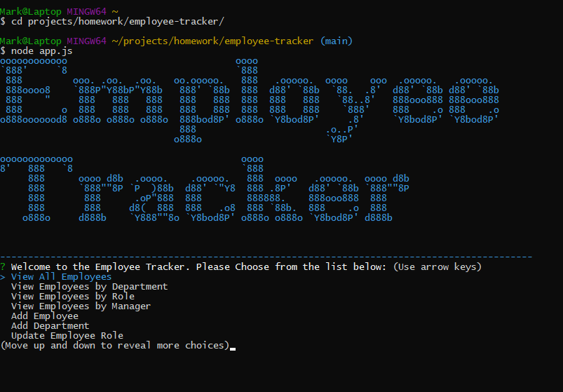

# Employee Tracker

## Description

A mini-CRM using node, inquirer, and MySql. Allows the user to view and manage the departments, roles, and employees within their company from within the command line.

## Table of Contents

1. [Installation](#Installation)
2. [Usage](#Usage)
3. [License](#License)
4. [Contributing](#Contributing)
5. [Tests](#Tests)
6. [Questions](#Questions)

## Installation

1. Clone the repo `https://github.com/markdcross/employee-tracker.git`
2. Install NPM Packages via `$ npm i`

## Usage

**PLEASE CLICK THE GIF BELOW FOR A "HOW TO USE" VIDEO:** 

[Usage video](https://drive.google.com/file/d/1jK9R3ryaNq16OTkNlf1HxsfqdeS5gGD1/view)

Run the application via `node app.js` and follow the prompts. Dummy data has been loaded in via seeds.sql.

## License

Licensed under the [MIT](https://github.com/markdcross/employee-tracker/blob/master/LICENSE.txt) license.

## Contributing

#### [Contributor Covenant Code of Conduct](https://www.contributor-covenant.org/version/2/0/code_of_conduct/)

## Tests

## Questions

Feel free to contact me with any questions or feedback:

-   GitHub: [markdcross](https://github.com/markdcross)
-   Email: <markdcross@gmail.com>
